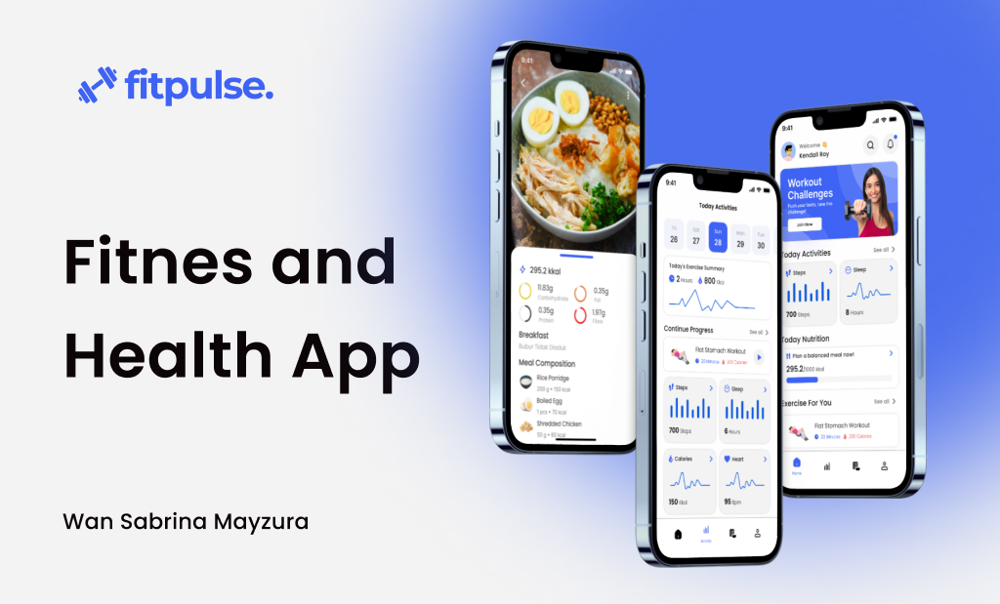

Here’s a stylish and engaging README template for your app based on the splash screen and onboarding flow. This README includes title, cover, description, and all the essential sections, sprinkled with emojis for extra flair:

---

# 💪 FitPulse - Your Fitness Companion 🌟



FitPulse is your go-to fitness app designed to seamlessly track your daily activities, monitor your nutrition, and guide you toward your fitness goals. Whether you are a beginner or a seasoned athlete, FitPulse is tailored to help you stay on track and achieve your healthiest self.

## 🚀 Features

- 🧘 **Track your Activity**: Monitor your daily exercise, steps, and other health stats with ease.
- 🍽️ **Nutrition Monitoring**: Keep a close eye on your calorie intake and nutritional balance.
- 🏋️ **Personalized Workouts**: Receive tailored workout tutorials that adapt to your fitness level and goals.
- 📊 **Progress Insights**: Visualize your progress over time with detailed graphs and reports.

## 🛠️ Installation

To get started with FitPulse, follow these steps:

1. **Clone the repository**:
    ```bash
    git clone https://github.com/wansabrina/fitpulse.git
    ```

2. **Install dependencies**:
    ```bash
    cd fitpulse
    flutter pub get
    ```

3. **Run the app**:
    ```bash
    flutter run
    ```

## 🖼️ Design

FitPulse’s design is inspired by simplicity, clean aesthetics, and user-centric functionality. The onboarding screens guide new users through the app's core functionalities while keeping them motivated and focused on their fitness journey.